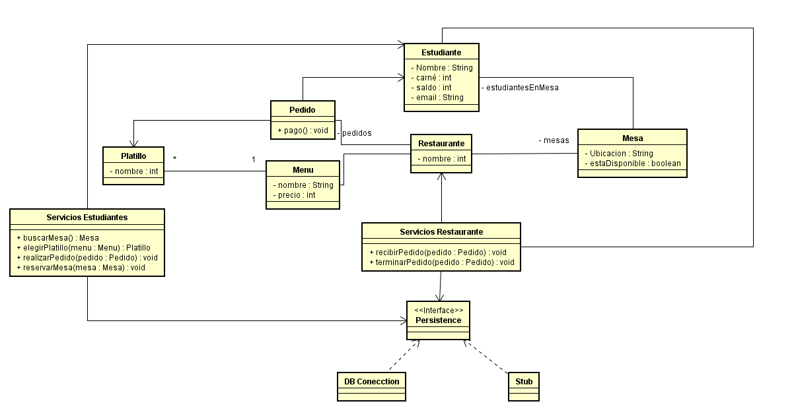
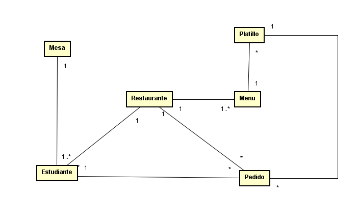
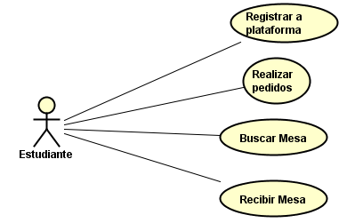
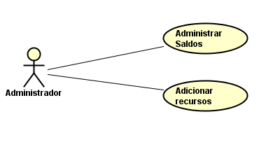
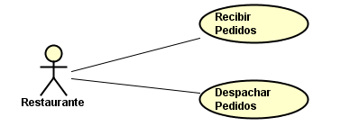

# ECI-STAURANT

Integrantes:
* Andres Felipe Marcelo
* Johan Sebastian Arias
* German Simon Marin

### Descripción (antecedentes, problema que se resuelve, etc.):
Diariamente, los estudiantes de la Escuela Colombiana de Ingenieria se enfrentan a entornos caoticos a la hora del almuerzo, pues se presentan extensas filas en los restaurantes, existe un acaparamiento de mesas del campus por parte de otros estudiantes que no emplean las mismas para comer.

Actualmente no existe una solucion para estas problematicas y como solución proponemos crear una aplicación web que permita administrar el manejo de las mesas de una manera mas óptima y el pedido de los almuerzos a travez de la aplicación.

#### Diagrama de clases

#### Diagrama Entidad-Relación

### Historias de usuario:

* COMO estudiante
QUIERO registrarme a la plataforma
PARA PODER disfrutar de los beneficios de esta. 

* COMO estudiante
QUIERO realizar pedidos
PARA PODER evitar filas en los horarios de almuerzo

  
* COMO estudiante
QUIERO buscar mesa
PARA PODER encontrar facilmente una mesa disponible para comer

* COMO estudiante
QUIERO recibir mesa
PARA PODER acceder facilmente una mesa disponible para comer

   
 
 
  
* COMO administrador
QUIERO administrar saldos
PARA PODER tener actualizada la información de los saldos de los clientes

* COMO administrador
  QUIERO administrar ecursos
  PARA PODER ampliar,eliminar y controlar  los recursos ofrecidos
 

* COMO restaurante
QUIERO recibir pedidos
PARA PODER agilizar manera de atender clientes

 

* COMO restaurante
QUIERO despachar pedidos
PARA PODER entregar el producto solicitado

### Mockups

#### Vista Home

Logeandose

Registrandose

Selecciona el rol.

Ingresa información adicional.

Apenas ingresa un usuario se encontrará con la siguiente vista donde podrá obsevar el estado de los partidos y loguearse.

Si selecciona un partido podrá ver el resumen en tiempo real.

Tambien podrá ver información de los jugadores.

Tambien podrá ver información de los equipos.

#### Vista Jugador

La siguiente es la vista que se encontrá un jugador.

Si selecciona un partido podrá ver el resumen en tiempo real.

Tambien podrá ver información de los jugadores.

Tambien podrá ver información de los equipos.

Además podrá ver información de su equipo.

#### Vista Capitan

Si ingresa un capitan podrá crear un equipo.

Tambien podrá eliminar y añadir un jugador.

Además podrá ver estadisticas de su equipo.

#### Vista Arbitro

Si ingresa un arbitro podrá ver sus proximos partidos.

Tambien podrá reportar un evento como gol, intento de gol, falta, penalty, etc

Selecciona el evento.

Reportando un gol.

Reportando un intento de gol.

Reportando una falta.

Reportando una tarjeta amarilla.

Reportando una tarjeta roja.

Reportando un penalty.

#### Vista Administrador

Si ingresa un administrador podrá crear un torneo

### Backlog

[Link backlog](https://drive.google.com/file/d/